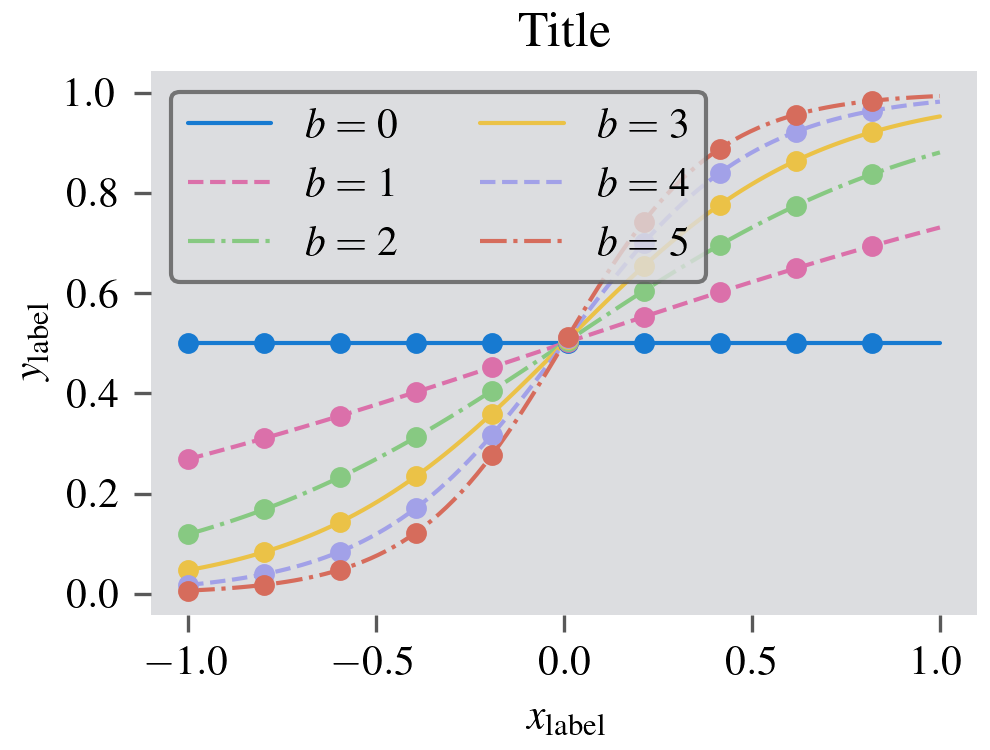
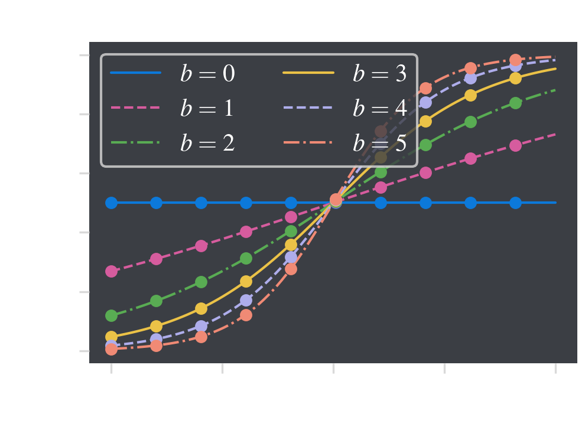

# cartography-styles
Matplotlib styles for the CartographY ERC project.

See `example.ipynb` on how to use the style sheets. The names of the style sheets should be replaced by their absolute or relative paths if they are not placed in your current working directory. You can combine any one style from each of the following sections with each of the other sections.

## Color schemes

There are two available color-schemes (`cartography-light` and `cartography-dark`) which I have created to be colorblind-friendly and work with CartographY poster templates. They comprise a cycle of 7 colors centered on the CartographY Yellow color. To imorove the accessibility of your plors, consider other styling options (such as line and marker styles) before cycling through all the colors - this is why I have limited the cycle to 7 colors.

## Fonts and sizes

There are two styles suitable for use in papers: `paper-single` and `paper-double` which span single-column and double-columns respectively. The `figsize` has been set to be compatible with most journals. I recommend that you do not change the `figsize` when using these styles to ensure font sizes scale with figure size. They also ensure 300 dpi (pixel density) which is inline with most journals' specifications.

## LaTeX

To render your plots with LaTeX (recommended when the figure is destined for a journal) put this line at the top of your document (or include it in your list of imported `matplotlib` styles):

```python
import matplotlib.pyplot as plt

plt.style.use('latex.mplstyle')
```

assuming that `latex.mplstyle` is in the current working directory (otherwise replace with the path to that file).

Note: the LaTeX style will not properly load through `plt.style.context('latex.mplstyle')`. LaTeX rendering is also slower and requires a local TeX installation.

## Examples

Here are two figures from `example.ipynb` which show the `light` and `dark` color schemes with the `paper-single` style and `latex` rendering.

CartographY light                                                        |  CartographY dark
:-----------------------------------------------------------------------:|:-------------------------------------------------------------------------:
`plt.style.use(['cartography-light', 'paper-single', 'latex.mplstyle'])` | `plt.style.use(['cartography-light', 'paper-single', 'latex.mplstyle'])`
                           |  


## Coming soon

- fonts and sizes to work with posters and presentations
- `pip` installable so the styles are easy to use
- any suggestions in the Issues are welcome
